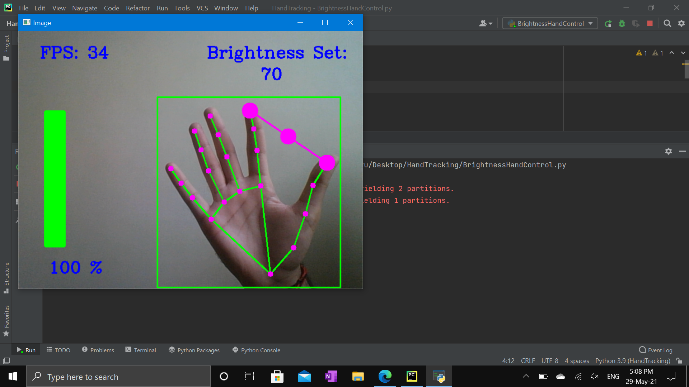
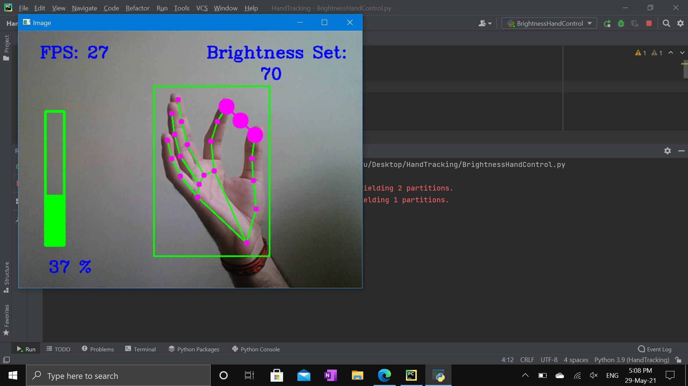
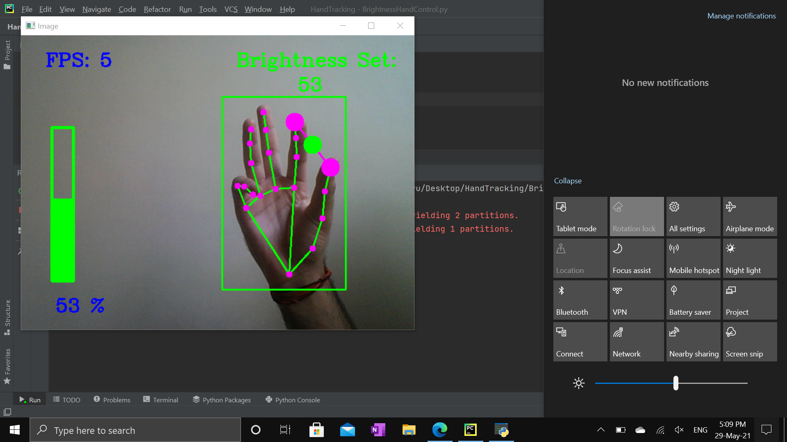
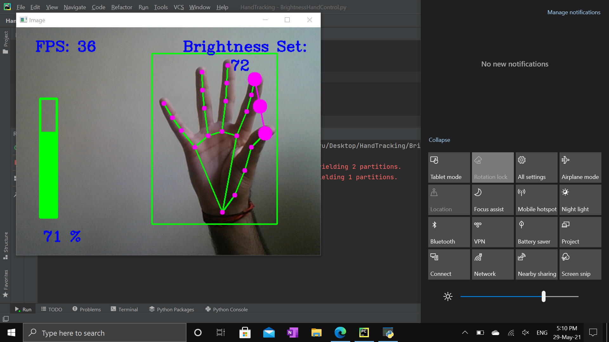

# Gesture_Brightness_Control

In this project I am using gestures to control and change the brightness of the screen. 
Here I am using my device camera which helps me to track my hand. 
By using the index finger and thumb, I can control/change the brightness of the screen. 
The distance between above-mentioned fingers is our range of brightness,
then we use the little finger to implement this change.

* This is how the project looks like when it execute.

* Looking of the range of the brightness.

* Setting the brightness of the window.

* Again performing the same functions.....

